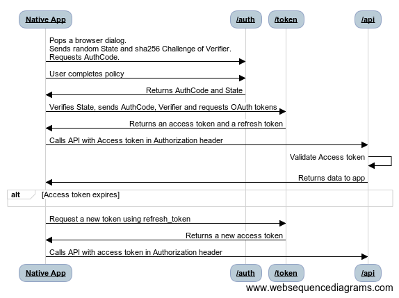

# Auth Code Grant 

## Usages

The OAuth 2.0 Proof Key for Code Exchange flow is described in [RFC 7636](https://tools.ietf.org/html/rfc7636). It is used to perform authorization typically in server-side web applications where the client_secret can be securely stored and kept safe. The flow enables apps to securely acquire access_tokens that can be used to access secured resources. 
Higher level discussion: https://www.oauth.com/oauth2-servers/pkce/
More BCP (as of 20190513) discussion in this draft: https://tools.ietf.org/html/draft-ietf-oauth-browser-based-apps-00

## Flow Diagram



<!-- Paste the following comment in this web site to edit the diagram and get a new image https://www.websequencediagrams.com/ -->
<!--
Flow Sequence:
Native App->/auth: Pops a browser dialog.\nSends random State and sha256 Challenge of Verifier. \nRequests AuthCode.
Native App->/auth: User completes policy
/auth->Native App: Returns AuthCode and State
Native App->/token: Verifies State, sends AuthCode, Verifier and requests OAuth tokens
/token->Native App: Returns an access token and a refresh token
Native App->/api:Calls API with Access token in Authorization header
/api->/api:Validate Access token
/api->Native App:Returns data to app
alt Access token expires
end
Native App->/token: Request a new token using refresh_token
/token->Native App: Returns a new access token
Native App->/api:Calls API with access token in Authorization header
-->


## Request Authorization Code

Begin the authorization code flow by having your registered application direct the user to the https://digitaldjpool.com/auth endpoint in their browser.

```
https://digitaldjpool.com/auth?
client_id=[YOUR-CLIENT-ID]
&response_type=code
&state=123456
&redirect_uri=https://127.0.0.1/yourapp
&scope=crates
&code_challenge=SHA256OFSOMERANDOMBINARYARRAY==  (base64 encoded)
&code_challenge_method=S256
```

| Parameter       | Required    | Description                                                                                                                                                                                                                                                                                                                                                                                          |
| --------------- | ----------- | ---------------------------------------------------------------------------------------------------------------------------------------------------------------------------------------------------------------------------------------------------------------------------------------------------------------------------------------------------------------------------------------------------- |
| `client_id`     | yes         | The unique application (client) ID provided to you from Digital DJ Pool                                                                                                                                                                                                                                                                                                                              |
| `response_type` | yes         | Must include code for the authorization code flow.                                                                                                                                                                                                                                                                                                                                                   |
| `state`         | yes			| A value included in the request that will also be returned in the token response. A randomly generated unique value is typically used for preventing cross-site request forgery attacks. The value can also encode information about the user's state in the app before the authentication request occurred, such as the page or view they were on. |
| `redirect_uri`  | yes         | The redirect_uri of your app, where authentication responses can be sent and received by your app. It must exactly match one of the redirect_uris you registered in the portal, except it must be url encoded.                                                                                                                                                                                       |
| `scope`         | yes         | A comma-separated list of scopes that you want the user to consent to.                                                                                                                                                                                                                                                                                                                               |
| `code_challenge`| yes			| The sha256 hashed value of a random binary verifier (verifier is saved to send with the token request later)
| `code_challenge_method`| yes			| We only currently accept "S256" |

At this point the user is presented with a page on DigitalDJPool.com that will allow the user to authenticate. Once authenticated the user will be prompted to grant access to your app for the requested scopes. The user is then sent back to your application at the configured `redirect_uri` with the specific one-time-use Auth Code in the querystring.

### Successful Response

```
GET https://127.0.0.1/yourapp?code=ABC123FFABD&state=123456
```

| Parameter | Description                                                                                                                                                                                                            |
| --------- | ---------------------------------------------------------------------------------------------------------------------------------------------------------------------------------------------------------------------- |
| `code`    | The authorization code that the app requested. The app can use the authorization code and the verifier used to create the challenge to request an access token for the target resource. Authorization codes are very short lived, typically expiring within minutes. |
| `state`   | The same state from the request should appear in the response. The app should verify that the state values in the request and response are identical.                                  |

## Request Access Token

Once an authorization code has been obtained an access_token must be obtained. Do this by sending a POST request to the /token endpoint. 
This request must provide the `client_id`, the `code`, and the `code_verifier` used in previous `challenge`


```
POST /token HTTP/1.1
Host: https://digitaldjpool.com
Content-Type: application/x-www-form-urlencoded

data: {
	grant_type: authorization_code
	code: ABC123FFABD
	redirect_uri: https://127.0.0.1/yourapp
	code_verifier: random-guid-usedfor-challenge (base64 encoded)
}

```

| Parameter      | Required | Description																									|
| -------------- | -------- | --------------------------------------------------------------------------------------------------------------|
| `client_id`    | Yes      | The unique application (client) ID provided to you from Digital DJ Pool										|
| `grant_type`   | Yes      | Must be authorization_code for the authorization code flow.													|
| `code`         | Yes      | The authorization code provided to your application in step one.												|
| `redirect_uri` | Yes      | The same redirect_uri value that was used to acquire the authorization code.									|
| `code_verifier`| Yes      | The same random binary array that was used to generate the challenge sent to acquire the authorization code.	|

### Successful Response

```
HTTP/1.1 200 OK
Content-Type: application/json

{
  "access_token":"jhr44jhfjkfs...",
  "token_type":"bearer",
  "expires_in":59,
  "refresh_token":"fdfr4frfrr"
}
```

| Parameter       | Description                                                                                                                                                                                                                                                                                                           |
| --------------- | --------------------------------------------------------------------------------------------------------------------------------------------------------------------------------------------------------------------------------------------------------------------------------------------------------------------- |
| `access_token`  | The requested access token. The application can now make requests to the DigitalDJPool API on behalf of that user, by sending along the Access Token you have received as a header of every request like Authorization: Bearer {AccessToken}                                                                          |
| `refresh_token` | An OAuth 2.0 refresh token. The app can use this token acquire additional access tokens after the current access token expires. Refresh tokens are long-lived, and can be used to retain access to resources for extended periods of time. For more detail on refreshing an access token, refer to the section below. |
| `token_type`    | Always set to Bearer.                                                                                                                                                                                                                                                                                                 |
| `expires_in`    | The number of seconds that access token is valid for.                                                                                                                                                                                                                                                                 |


## Use Access Token

The acquired access token should be included in the Authorization header for all subsequent API calls

```
GET /api/users/ApiDemoUser/crates
Host: https://digitaldjpool.com
Authorization: Bearer jhr44jhfjkfs...
```

## Refresh Access Token

Access tokens are short lived, and you must refresh them after they expire to continue accessing resources. Once the access token expires the DigitalDJPool API will respond with an Http Status Code of 401 (Unauthorized). Your web server should be able to intercept this response and then use the Refresh Token to obtain a new Access Token. You can do so by submitting another POST request to the /token endpoint, this time providing the refresh_token instead of the code. 

Refresh tokens do not have specified lifetimes. Typically, the lifetimes of refresh tokens are relatively long. However, in some cases, refresh tokens expire, are revoked, or lack sufficient privileges for the desired action. Your application needs to expect and handle errors returned by the token issuance endpoint correctly. Note that refresh tokens are not revoked when used to acquire new access tokens.

```
POST /token HTTP/1.1
Host: https://digitaldjpool.com
Content-Type: application/x-www-form-urlencoded

grant_type=refresh_token
&client_id=[YOUR-CLIENT-ID]
&client_secret=[YOUR-CLIENT-SECRET]
&refresh_token=[YOUR-REFRESH-TOKEN]

```

| Parameter       | Required | Description                                                             |
| --------------- | -------- | ----------------------------------------------------------------------- |
| `grant_type`    | Yes      | Must be `refresh_token` for this step of the authorization code flow.   |
| `client_id`     | Yes      | The unique application (client) ID provided to you from Digital DJ Pool |
| `refresh_token` | Yes      | The `refresh_token` that you acquired in the second step of the flow.   |

### Successful Response

```
HTTP/1.1 200 OK
Content-Type: application/json

{
  "access_token": "jhr44jhfjkfs",
  "token_type":"bearer",
  "expires_in":59
}
```

| Parameter       | Description                                                                                                                                                                                                                                  |
| --------------- | -------------------------------------------------------------------------------------------------------------------------------------------------------------------------------------------------------------------------------------------- |
| `access_token`  | The requested access token. The application can now make requests to the DigitalDJPool API on behalf of that user, by sending along the Access Token you have received as a header of every request like Authorization: Bearer {AccessToken} |
| `expires_in`    | The number of seconds that access token is valid for.                                                                                                                                                                                        |
| `refresh_token` | Token used to acquire new access tokens and refresh tokens as documented below.                                                                                                                                                              |
