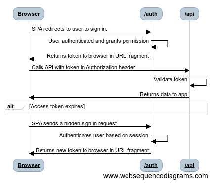

# Implicit Grant 

## Usages

Implicit grant will allow users to sign into your single-page app. Single-page and other JavaScript apps that run in a browser face authentication challenges.

The implicit flow is described in the [OAuth 2.0 Specification 4.2](https://tools.ietf.org/html/rfc6749#section-4.2). It allows the app to get tokens from Digital DJ Pool without performing a backend server credential exchange. This allows the app to sign the user in, maintain session, and get tokens to APIs all within the client JavaScript code.

## Flow Diagram



<!--
Flow Sequence:
Browser->/auth: SPA redirects to user to sign in.
/auth->/auth: User authenticated and grants permission
/auth->Browser: Returns token to browser in URL fragment
Browser->/api:Calls API with token in Authorization header
/api->/api:Validate token
/api->Browser:Returns data to app
alt Access token expires
end
Browser->/auth: SPA sends a hidden sign in request
/auth->/auth: Authenticates user based on session
/auth->Browser: Returns new token to browser in URL fragment
-->

## Sign In Request

This flow will open another window with query string params where users can enter Digital DJ Pool account username and password and then grant the authentication. Digital DJ Pool redirect back to the provided `redirect_uri`. Unlike Auth code method here the `access_token` is provided on the url after a hashbang (`#`) in the format `redirect_uri#access_token=xxxxxxxxxxxxxxxxxxxx` (e.g: `https://example.com/oauth-redirect#access_token=XXXXXXXXXXXXXXXXXXX&token_type=bearer&expires_in=60`). The redirected page in the client's app should store the `access_token` and use it to make api requests.

```javascript
$('#btnAuthorize').click(function () {
  var authorizeUri = 'https://digitaldjpool.com/auth'; 
  var uri = addQueryString(authorizeUri, {
    'client_id': client_id,
    'redirect_uri': redirect_uri,
    'scope': 'crates',
    'response_type': 'token',
  });

  var oauthWindow = window.open(uri, 'Authorize', 'width=640,height=480');

  var timer = setInterval(function () {
    if (oauthWindow.closed) {
      clearInterval(timer);

      alert(Cookies.get('access_token'));
    }
  }, 500);
});
```

On implicit grant method, after redirection after Authorization is granted, the url should be parsed and the `access_token` should be stored.

```javascript
var queryString = parseQueryString(window.location.hash.substr(1));

Cookies.set('access_token', queryString.access_token);

if (window.parent !== window) { // this is an iframe doing silent auth (assume with id ifrOauth)
  $('#ifrOauth').remove(); // remove the iframe when it has been authenticated silently
} else { // this is a popup window and user clicked on 'grant'
  window.close();
}
```

## Refreshing Tokens

While making an API request on `401 unauthorized` an iframe can be used to retrieve new `access_token`

```javascript
function getNewAccessToken() {
  var authorizeUri = 'https://digitaldjpool.com/auth'; 

  var uri = addQueryString(authorizeUri, {
    'prompt': 'none',
    'client_id': client_id,
    'redirect_uri': redirect_uri,
    'scope': 'crates',
    'response_type': 'token',
  });

  $('body').append($('<iframe id="ifrOauth" style="display:none" src=' + uri + ' />'));
}
```

This method also open another window with query string params where users can enter Digital DJ Pool account username and password and then grant the authentication. Digital DJ Pool redirect back to the provided `redirect_uri`. Unlike Auth code method here the `access_token` is provided on the url after a hashbang (`#`) in the format `redirect_uri#access_token=xxxxxxxxxxxxxxxxxxxx` (e.g: `https://example.com/oauth-redirect#access_token=XXXXXXXXXXXXXXXXXXX&token_type=bearer&expires_in=60`). The redirected page in the client's app should store the `access_token` and use it to make api requests.

```javascript
$('#btnAuthorize').click(function () {
  var authorizeUri = 'https://digitaldjpool.com/auth'; 
  var uri = addQueryString(authorizeUri, {
    'client_id': client_id,
    'redirect_uri': redirect_uri,
    'scope': 'crates',
    'response_type': 'token',
  });

  var oauthWindow = window.open(uri, 'Authorize', 'width=640,height=480');

  var timer = setInterval(function () {
    if (oauthWindow.closed) {
      clearInterval(timer);

      alert(Cookies.get('access_token'));
    }
  }, 500);
});
```

On implicit grant method, after redirection after Authorization is granted, the url should be parsed and the `access_token` should be stored.

```javascript
var queryString = parseQueryString(window.location.hash.substr(1));

Cookies.set('access_token', queryString.access_token);

if (window.parent !== window) { // this is an iframe doing silent auth (assume with id ifrOauth)
  $('#ifrOauth').remove(); // remove the iframe when it has been authenticated silently
} else { // this is a popup window and user clicked on 'grant'
  window.close();
}
```

while making an API request on `401 unauthorized` an iframe can be used to retrieve new `access_token`

```javascript
function getNewAccessToken() {
  var authorizeUri = 'https://digitaldjpool.com/auth'; 

  var uri = addQueryString(authorizeUri, {
    'prompt': 'none',
    'client_id': client_id,
    'redirect_uri': redirect_uri,
    'scope': 'crates',
    'response_type': 'token',
  });

  $('body').append($('<iframe id="ifrOauth" style="display:none" src=' + uri + ' />'));
}
```