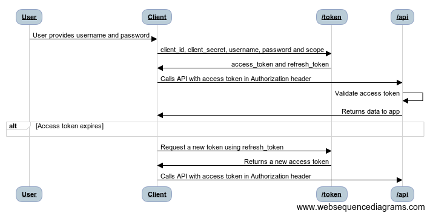

# Resource Owner Password Credentials Grant

## Usages

The OAuth 2.0 Resource Owner Password Credentials Grant flow is described in [section 4.3 of the OAuth 2.0 specification](https://tools.ietf.org/html/rfc6749#section-4.3). This flow requires that the application handles the user's credentials directly. Therefore, this flow requires a high degree of trust between the user and the application. This flow should be used when other, more secure, flows can't be used. 

## Flow Diagram



<!--
Flow Sequence:
User->Client: User provides username and password
Client->/token: client_id, client_secret, username, password and scope
/token->Client: access_token and refresh_token
Client->/api: Calls API with access token in Authorization header
/api->/api:Validate access token
/api->Client:Returns data to app
alt Access token expires
end
Client->/token: Request a new token using refresh_token
/token->Client: Returns a new access token
Client->/api:Calls API with access token in Authorization header
-->

## Authorization Request

This flow starts with the application directly prompting the user for their credentials. These credentials are sent to Digital DJ Pool and a token is returned. After a successful request, the client application must immediately release the user's credentials; the client application must not save user credentials.

```
# Note: Line breaks for clarity

POST /token HTTP/1.1
Host: https://digitaldjpool.com
Content-Type: application/x-www-form-urlencoded

client_id=[YOUR-CLIENT-ID]
&client_secret=[YOUR-CLIENT-SECRET]
&grant_type=password
&scope=crates
&username=[USERNAME]
&password=[USER-PASSWORD]
```

| Parameter       | Required | Description                                                             |
| --------------- | -------- | ----------------------------------------------------------------------- |
| `client_id`     | Yes      | The unique application (client) ID provided to you from Digital DJ Pool |
| `client_secret` | Yes      | The unique client secret provided to you from Digital DJ Pool           |
| `grant_type`    | Yes      | Must be `password` `for the authorization code flow.                    |
| `scope`         | Yes      | A comma-separated list of scopes that you want the user to consent to.  |
| `username`      | Yes      | The user's username.                                                    |
| `password`      | Yes      | The user's password.                                                    |

### Successful Response

```
{
  "access_token":"_DiaXDd627lr...",
  "token_type":"bearer",
  "expires_in":59,
  "refresh_token":"92a136be-dd9d-4344-b6b5-0164d2c201e6"
}
```

| Parameter       | Description                                                                     |
| --------------- | ------------------------------------------------------------------------------- |
| `access_token`  | The token to be used for subsequent api calls                                   |
| `token_type`    | Always set to Bearer.                                                           |
| `expires_in`    | The number of seconds that access token is valid for.                           |
| `refresh_token` | Token used to acquire new access tokens and refresh tokens as documented below. |

### Example Code

#### cUrl
> `curl POST https://digitaldjpool.com/token -H 'Content-Type: application/x-www-form-urlencoded' -d grant_type=password -d scope=crates -d client_id=[YOUR-CLIENT-ID] -d client_secret=[YOUR-CLIENT-SECRET] -d username=username -d password=password`

#### jQuery

```javascript
var settings = {
  "url": "https://digitaldjpool.com/token",
  "method": "POST",
  "headers": {
    "Content-Type": "application/x-www-form-urlencoded",
  },
  "data": {
    "grant_type": "password",
    "scope": "crates",
    "client_id": client_id,
    "client_secret": client_secret,
    "username": username,
    "password": password
  }
}

$.ajax(settings).done(function (response) {
  console.log(response);
  // For simplification js-cookie npm module's 'Cookies' is used to set the cookies.
  // Any other method can be used to save the tokens
  Cookies.set('access_token', response.access_token);
  Cookies.set('refresh_token', response.refresh_token);
});
```

## Use Access Token

The acquired access token should be included in the Authorization header for all subsequent API calls

```
GET /api/users/ApiDemoUser/crates
Host: https://digitaldjpool.com
Authorization: Bearer _DiaXDd627lr...
```

## Refresh Access Token

Access tokens are short lived, and you must refresh them after they expire to continue accessing resources. Once the access token expires the DigitalDJPool API will respond with an Http Status Code of 401 (Unauthorized). Your web server should be able to intercept this response and then use the Refresh Token to obtain a new Access Token. You can do so by submitting another POST request to the /token endpoint, this time providing the refresh_token instead of the code. 

Refresh tokens do not have specified lifetimes. Typically, the lifetimes of refresh tokens are relatively long. However, in some cases, refresh tokens expire, are revoked, or lack sufficient privileges for the desired action. Your application needs to expect and handle errors returned by the token issuance endpoint correctly. Note that refresh tokens are not revoked when used to acquire new access tokens.

```
POST /token HTTP/1.1
Host: https://digitaldjpool.com
Content-Type: application/x-www-form-urlencoded

{
    "grant_type": "refresh_token",
    "client_id": [YOUR-CLIENT-ID],
    "client_secret": [YOUR-CLIENT-SECRET],
    "refresh_token": [YOUR-REFRESH-TOKEN]
}
```

| Parameter       | Required | Description                                                             |
| --------------- | -------- | ----------------------------------------------------------------------- |
| `grant_type`    | Yes      | Must be `refresh_token` for this step of the authorization code flow.   |
| `client_id`     | Yes      | The unique application (client) ID provided to you from Digital DJ Pool |
| `client_secret` | Yes      | The unique client secret provided to you from Digital DJ Pool           |
| `refresh_token` | Yes      | The `refresh_token` that you acquired in the second step of the flow.   |

### Successful Response

```
{
  "access_token": "jhr44jhfjkfs",
  "token_type":"bearer",
  "expires_in":59
}
```

| Parameter       | Description                                                                                                                                                                                                                                  |
| --------------- | -------------------------------------------------------------------------------------------------------------------------------------------------------------------------------------------------------------------------------------------- |
| `access_token`  | The requested access token. The application can now make requests to the DigitalDJPool API on behalf of that user, by sending along the Access Token you have received as a header of every request like Authorization: Bearer {AccessToken} |
| `expires_in`    | The number of seconds that access token is valid for.                                                                                                                                                                                        |
| `refresh_token` | Token used to acquire new access tokens and refresh tokens as documented below.                                                                                                                                                              |

### Examples

#### jQuery

```javascript
var settings = {
  "url": "https://digitaldjpool.com/token",
  "method": "POST",
  "headers": {
    "Content-Type": "application/x-www-form-urlencoded",
  },
  "data": {
    "grant_type": "refresh_token",
    "client_id": client_id,
    "client_secret": client_secret,
    "refresh_token": refresh_token
  }
}

$.ajax(settings).done(function (response) {
  console.log(response);
  // For simplification js-cookie npm module's 'Cookies' is used to set the cookies.
  // Any other method can be used to save the tokens
  Cookies.set('access_token', response.access_token);
});
```
